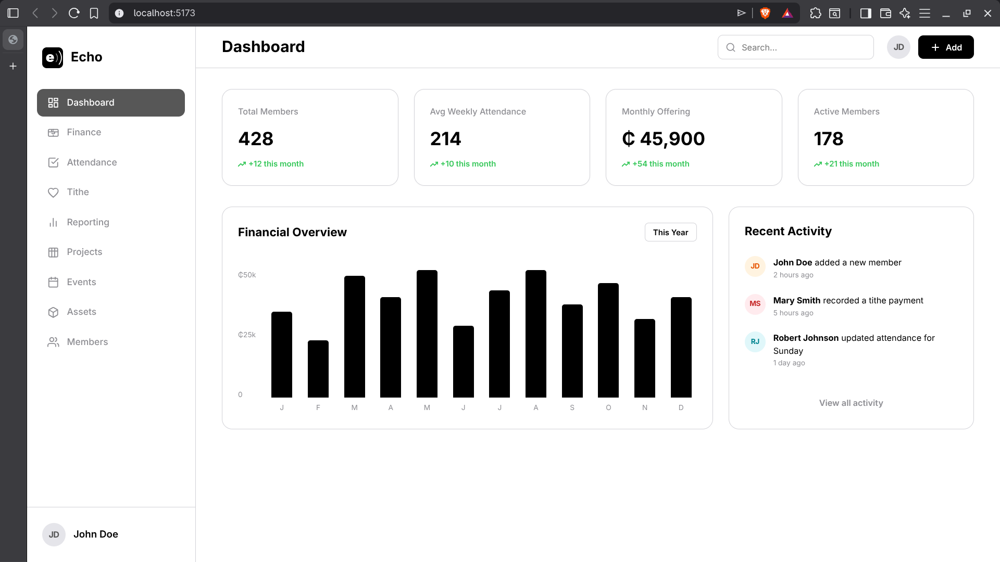

# Echo

Echo is a multi-tenant church management platform — a single place for a congregation to run its administration: who its members are, what it owns, what it's raising money for, and how it's doing financially. Each congregation is its own isolated tenant, with admins bringing members in and managing access from there.



## Scope

- **Membership** — who belongs to the congregation and its sub-groups
- **Events & attendance** — what's happening and who showed up
- **Tithes** — member giving over time
- **Finance** — income and expenses
- **Inventory & assets** — what the congregation owns
- **Projects** — what it's building toward
- **Reporting & analytics** — insight across all of the above

## Tech Stack

React (TypeScript) frontend, ASP.NET Core (.NET 10) backend, PostgreSQL, Entity Framework Core.

## Structure

Echo is a monorepo with three parts:

```markdown
echo/
├── backend/    # .NET modular monolith — see backend/README.md
├── frontend/   # React + TypeScript client — see frontend/README.md
└── docs/       # API, database, and architecture reference
```

- [`backend/README.md`](./backend/README.md) — module breakdown, local setup, migrations
- [`frontend/README.md`](./frontend/README.md) — local setup, project layout
- [`docs/`](./docs/) — API architecture, database schema, ERDs

## Contributing

See [`CONTRIBUTING.md`](./CONTRIBUTING.md) for branch naming, PR workflow, and code standards.

## License

All rights reserved. See [`LICENSE.md`](./LICENSE.md).
