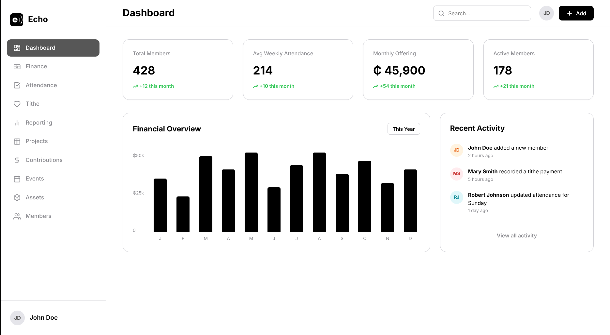

# Echo

> A multi-tenant church management platform built with a .NET Core Web API as it's core engine, a React client and Docker.

Echo handles congregations, members, events tracking, attendance, asset and Inventory tracking, etc.
It is designed to be modular, containerized and ready for multiple clients.



---

## Table of Contents

- [Tech Stack](#tech-stack)
- [Quick Start](#quick-start)
- [Documentation](#documentation)
- [Development Workflow](#development-workflow)
- [Contributing](#contributing)
- [License](#license)

---

## Tech Stack

- **Database**: PostgreSQL 18
- **ORM**: Entity Framework Core
- **API**: ASP.NET Core Web API
- **Presentation Layer**:
    - React: Frontend SPA (Vite for dev hot-reload, static Nginx serving in production).

- **Infrastructure & Orchestration**:
    - Containerization: Docker
    - Reverse Proxy: Nginx

- **Testing & QA**: xUnit / Moq

---

## Quick Start

### Prerequisites

- [Docker](https://www.docker.com/get-started)
- [Git](https://git-scm.com/)
- [.NET 10 SDK](https://dotnet.microsoft.com/en-us/download) (if running outside Docker)
- [PostgreSQL 18](https://www.postgresql.org/download/) (if running outside Docker)

### 1. Clone the repo

```bash
git clone https://github.com/clintonbampoe/echo.git
cd echo
```

### 2. Configure secrets

Copy `.env.example` to `.env` and fill in the required values:

```bash
cp .env.example .env
```

> [!IMPORTANT]
> **Note**: JWT Keys need to be base64 encoded because raw PEM keys break the `.env` format.
> The application decodes them before use. See (Infrastructure)[./docs/Infrastructure.md] for all required env variables.
> To generate them, run:

```bash
cd backend/tools/jwt-key-setup
sh setup-jwt-keys.sh env
```

This checks your `.env` file and generates the keys if missing. On Windows, use Git Bash or WSL.
As this script is only guaranteed to run in Linux and Unix environments.

### 3. Build container images

```bash
# In Development
docker compose Build

# In Production (uses docker-compose.prod.yml override)
docker compose -f docker-compose.yml -f docker-compose.prod.yml build
```
> First build takes a seconds to minutes depending on your internet speed, since Docker pulls the SDKs and dependencies.
> Subsequent builds are cached and fast.

### 4. Start the container stack

```bash
# In Development
docker compose up

# In Production
docker compose -f docker-compose.yml -f docker-compose.prod.yml up -d
```

Automatic database migrations on API startup are set with the `RUN_DATBASE_MIGRATIONS_ON_STARTUP=true` flag in the `.env` file.
To run manually migrations (especially in production environments), please use the `migrator` container tool

```bash
docker-compose run --rm migrator
```

### 5. Verify the API is running

You can verify the api is running by checking the health endpoint.
For more details on how to use the API, see (Api Usage)[./docs/api/ApiUsage.md]

```bash
curl http://localhost:8080/api/health/ready
```

**Available Endpoints (When API is running)**

Dev: API at `http://localhost:5025` (direct) or `http://localhost:8080` (via nginx)

Prod: `http://localhost:80` (via nginx only)

Api Docs Swagger UI: `http://localhost:8080/swagger`

Api Docs Scalar UI: `http://localhost:8080/scalar`

---

## Documentation

Complete documentation lives in the `/docs` directory.
See (Documentation)[./docs/README.md]

---

## Development Workflow

We use Github Issues and Pull Requests. Here's a rough flow:

1. **Find or create an issue** -- Use the appropriate template.
2. **Fork or Clone the repo**
3. **Make your changes** -- Keep PRs focused.
4. **Write tests** if adding something new (we're building out our testing suite--ask if unsure).
5. **Open a Pull Request** against `main` -- use the PR template.
6. **Wait for review** -- maintainers will give feedback or approve.

---

## Contributing

We welcome contributions of all kinds--bug reports, feature ideas, code or even pointing out confusing parts of the docs.

- **Report a bug** -- Use the Bug Report template.
- **Suggest a feature** -- Use the Feature Request template.
- **Security issues** -- Do not open a public issue. See (Security Policy)[./SECURITY.md].
- **Chores / Refactors** -- Use the Chore template.

Check out (CONTRIBUTING.md)[./CONTRIBUTING.md] for full details, including how to report issues, code style, and the review process.

---

## License

See the (License Policy)[./LICENSE.md] for full details.

## Acknowledgements

Thanks to everyone who has contributed so far--whether by reporting issues, suggesting improvements, or writing code. Echo wouldn't be where it is without you.

