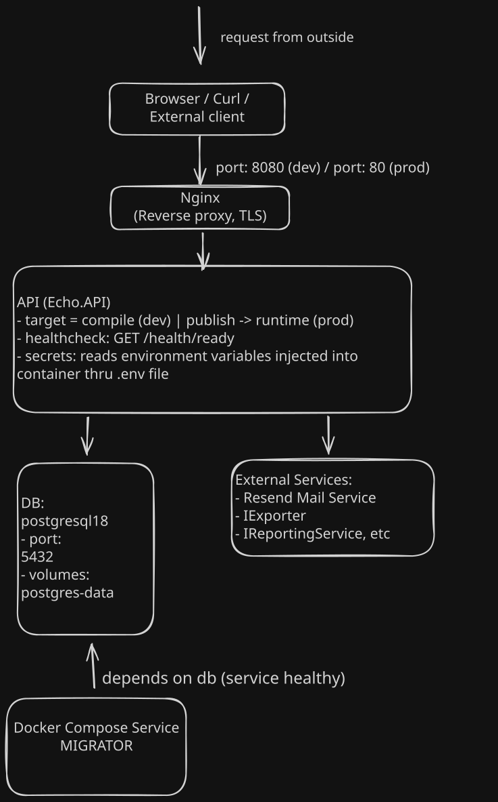
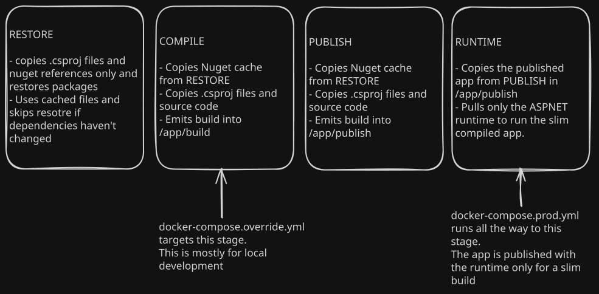

# Infrastructure

**Written by:** @clintonbampoe
**Last updated:** 2026-07-31 by @clintonbampoe

---

This explains how Echo runs: the Docker containers, how they're built, how they
talk to each other, and every environment variable the app needs.

Not covered here: how the back-end's code is organized (see `Architecture.md`,
not written yet) or how to set up locally (see [Setup.md](GettingStarted.md)).

_If the compose files or Dockerfile have changed since
then, this doc may be out of date — check `git log` on them before trusting it,
and update this doc if you're the one making the change. If not flag this to the maintainers for review_

## The containers



**`api`** — the backend. In dev, it rebuilds fast because it skips the restore
step on every change. In prod, it runs the final, compiled version. Nginx only
sends it traffic once it's confirmed healthy.

**`db`** — Postgres 18. Data is stored in a volume so it survives restarts. In
prod, only `api` can reach it — it's not open to the outside world.

**`nginx`** — sits in front of `api` and forwards requests to it.

**`migrator`** — runs database migrations. Doesn't start automatically — you run
it yourself when you want to. See [Setup.md](GettingStarted.md) for when to use this.

### Why there are three compose files

One base file, shared by everything. One file for dev-only settings, which loads automatically — you don't need to type anything extra. One file for prod-only settings, which you have to ask for explicitly by naming it.

- dev

```bash
docker compose up
```

- prod

  ```bash
  docker compose -f docker-compose.yml -f docker-compose,prod.yml build up
  ```

That last part matters: asking for a specific file by name switches off the automatic dev file entirely, so dev settings and prod settings can never both apply at once by accident.

## How the build works



Building the app happens in four steps:

- **Restore** — download the packages the app needs. This only reruns when a project or package file actually changes — editing regular source code doesn't  trigger it, which is what makes rebuilds fast.
- **Compile** — Pulls the entire .NET Sdk to build the code. the dev pipeline stops here.
- **Publish** — package the app to run.
- **Runtime** — the final image. Only pulls the slim ASP.NET runtime to run the compiled package. No build tools included, just what's needed to run the app. This is what actually ships to prod.

## Ports

| Port | Service | Reachable from outside?            | Dev | Prod |
| ---- | ------- | ---------------------------------- | --- | ---- |
| 8080 | nginx   | YES                                | YES | —    |
| 80   | nginx   | YES                                | —   | YES  |
| 5025 | api     | YES (dev convenience, skips nginx) | YES | —    |
| 5432 | db      | YES in dev, no in prod             | YES | --   |

Requests always flow the same way: **nginx → api → db**. Nothing else is open.

## How data persists

To persist data in the containers, we've mounted certain named volumes that data is saved into outside the containers to survive container teardown

| Volume          | What it's for          | Can I delete it?                                     |
| --------------- | ---------------------- | ---------------------------------------------------- |
| `postgres-data` | The actual database    | No — deleting this deletes your data.                |
| `nuget-cache`   | Speeds up dev rebuilds | YES, safely. It'll just rebuild the cache next time. |

## Environment variables

Checked against `.env.example` and the actual code as of 2026-07-31.
If you add or change a variable or the structure of the `.env` file, update this table in the same change — the code is what's actually true, this table just describes it.

| Variable                             | Required | Used by | What it's for                                                                                                                                                            |
| ------------------------------------ | -------- | ------- | ------------------------------------------------------------------------------------------------------------------------------------------------------------------------ |
| `DB_NAME`                            | YES      | db, api | Name of the Postgres database                                                                                                                                            |
| `DB_USERNAME`                        | YES      | db, api | Postgres login username                                                                                                                                                  |
| `DB_PASSWORD`                        | YES      | db, api | Postgres login password                                                                                                                                                  |
| `RESEND_API_KEY`                     | YES      | api     | Sends emails through Resend                                                                                                                                              |
| `FRONTEND_BASE_URL`                  | YES      | api     | Builds links in outgoing emails (password reset, email verification). This is not CORS config — it doesn't control which origins can call the API.                       |
| `MAIL_CLIENT_ADDRESS`                | YES      | api     | The "from" address on outgoing emails                                                                                                                                    |
| `RUN_DATABASE_MIGRATIONS_ON_STARTUP` | NO       | api     | `true` by default — applies migrations automatically when the API starts. Set to `false` if you'd rather run them yourself with `docker-compose run --rm migrator`.      |
| `JWT_PRIVATE_KEY`                    | YES      | api     | Signs login tokens. Stored base64-encoded, not raw PEM — raw PEM has line breaks that don't survive `.env`'s format. See [setup.md](GettingStarted.md).                         |
| `JWT_PUBLIC_KEY`                     | YES      | api     | Checks that login tokens are genuine. Same base64 encoding as above.                                                                                                     |
| `JWT_ISSUER`                         | YES      | api     | Stamped onto every token when it's created. Must exactly match the value the API checks tokens against — if it doesn't, logins fail with no clear error telling you why. |
| `JWT_AUDIENCE`                       | YES      | api     | Same rule as `JWT_ISSUER` — created and checked with the same value, or you get a silent, confusing failure.                                                             |

## Troubleshooting

This section is empty cause there have been no incidents yet.
Add to it only after you've actually fixed something —
It's main purpose is to document the steps we took to fix a problem, so that we don't have to solve it twice, not to guess what might go wrong in advance.

### How to write an entry

| Column      | What to write                                                                                   |
| ----------- | ----------------------------------------------------------------------------------------------- |
| Symptom     | What you saw, in plain words — specific enough that someone else hitting it would recognize it. |
| First check | The fastest way to confirm it's this problem — usually a `docker-compose logs` command.         |
| Root cause  | One sentence: what was actually wrong.                                                          |
| Fix         | Exactly what you did to fix it.                                                                 |
| Date        | The date you confirmed the fix worked.                                                          |
| Added by    | Your GitHub handle, in case someone has questions.                                              |

**Add an entry if:** it took you real time to figure out, or the cause wasn't
obvious from the error alone.

**Don't add an entry if:** it was just a missing env var with no real mystery, or
the error message already told you exactly what was wrong.

See [Conventions in README](./README.md#conventions) for the full ruleset on who can add entries and how.

### Example

| Field       | Value                                                                                                  |
| ----------- | ------------------------------------------------------------------------------------------------------ |
| Symptom     | API keeps restarting right after `docker-compose up`. Logs say `No supported key formats were found`.  |
| First check | `docker-compose logs api \| grep -i jwt`                                                               |
| Root cause  | `JWT_PRIVATE_KEY` in `.env` was raw PEM, not base64. Raw PEM doesn't survive `.env`'s format properly. |
| Fix         | Run `sh backend/tools/jwt-key-setup/setup-jwt-keys.sh env` to regenerate the keys correctly.           |
| Date        | 2026-07-31                                                                                             |
| Added by    | @clintonbampoe                                                                                         |
